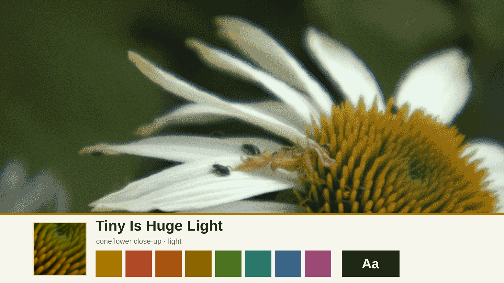
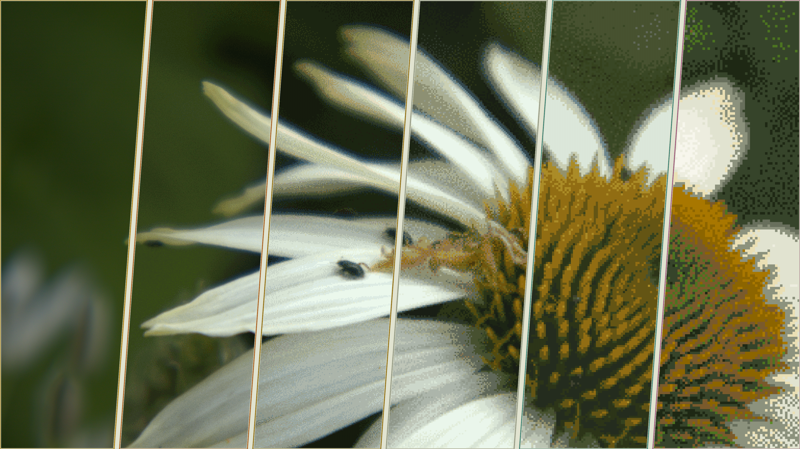
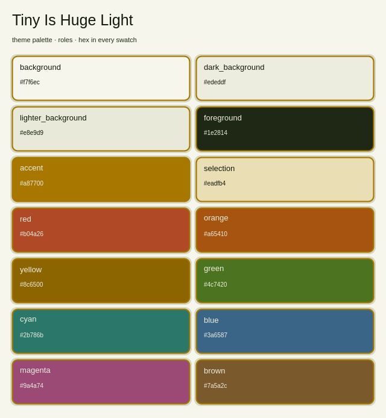

# Tiny Is Huge Light

A light, optimistic springtime Omarchy theme from a close-up of a white
coneflower with tiny beetles on its petals: petal-cream surfaces, beetle-dark
text, goldenrod focus from the cone, and fresh leaf greens. Its dark companion is
[Tiny Is Huge Dark](https://github.com/benredrew/omarchy-tiny-is-huge-dark-theme).



## Install

```bash
omarchy theme install https://github.com/benredrew/omarchy-tiny-is-huge-light-theme.git
```

Then choose **Tiny Is Huge Light** from Omarchy's theme picker, or run:

```bash
omarchy theme set tiny-is-huge-light
```

## Backgrounds

Six ordered treatments of the same photo, made with `agent-theme-levels
--method low-res-speckle --levels 6`: **A Crisp**, **B Light 20**, **C Light
40**, **D Medium 60**, **E Medium 80**, and **F Strong**. Each averages the
photo into hard-edged pixels that keep its local color, reduces the colors with
half-strength dithering, and adds light grain; F is drawn only from the
theme's own colors. D is the intended look. Omarchy starts on A; switch with
`omarchy theme bg next`.

## Previews

| Wallpaper treatment levels | Palette |
| --- | --- |
|  |  |

## Photo

A white coneflower close-up by [benredrew](https://github.com/benredrew),
developed from the original camera RAW, cropped to 16:9 and treated as above.
It is the theme author's own photograph.

## License

[CC0 1.0 Universal](https://creativecommons.org/publicdomain/zero/1.0/): the
theme files, wallpapers and previews are dedicated to the public domain. Use
them for anything, no credit required.
